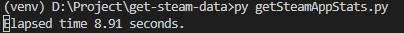
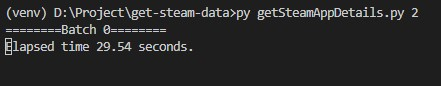

# get-steam-data
Get Steam app data using their public API and Steamspy API with python.

## How to Use
Clone this repository `git clone https://github.com/yudopr11/get-steam-data.git`. Create virtual environment and install packages from requirements.txt.
1. Run `python getSteamApps.py` to get all steam_appid and its name from Steam Public API.
2. Run `python getSteamAppStats.py` to get steam app statistics from Steamspy API. 

3. Run `python getSteamAppDetails.py no_of_batch` to get Steam app details from Steam Public API. 

## Notes
- Step 2 and 3 are interchangeable and can be run in parallel. You can run step 3 first then step 2 or run them in parallel.
- Steam public API have limit 200 request/5 minutes so you can not get all the data in one day.
- Steamspy data always refreshed each day.
- Better to get data that is less likely to change, such as appid, name, genres, initial price, platform, etc.
- Please read my comments on *.py files for better description for each program.